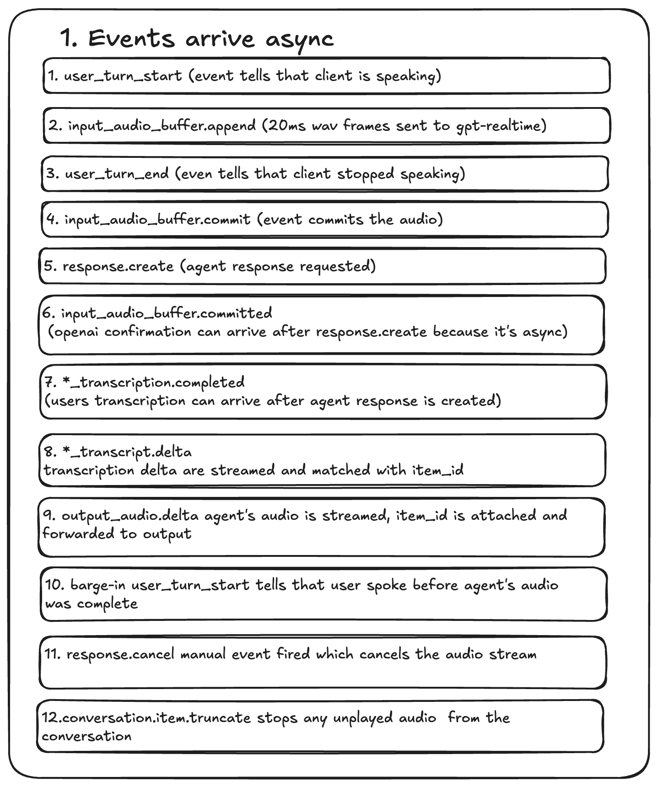

# Real-Time Voice Agent Demo

## Stack

- `realtime-py/`: FastAPI service, fake WAV caller, OpenAI Realtime bridge, transcript persistence
- `realtime-nextjs/`: Next.js app, API proxy routes, demo trigger button, transcript UI
- Storage: JSON files under `realtime-py/data/calls/`

## Architecture

```text
realtime-py/scripts/fake_call.py
  -> streams audio_0.wav, audio_1.wav, and audio_2.wav as timed 20 ms PCM frames
  -> sends user_turn_start / media / user_turn_end events from fixture boundaries

realtime-py/app/server.py
  -> accepts the fake caller WebSocket at /media-stream
  -> forwards audio frames to OpenAI Realtime
  -> commits each WAV turn and requests the response immediately at user_turn_end
  -> streams agent audio frames back to the caller
  -> handles barge-in and writes aligned transcripts
  -> exposes GET /calls, GET /calls/{call_id}, and POST /demo-call

realtime-nextjs/
  -> proxies GET /api/calls, GET /api/calls/[id], and POST /api/demo-call to Python
  -> provides a Run demo button that triggers the fixture call without a terminal script
  -> renders the transcript as chat bubbles with timings and interruption markers
```

#### Order of operations



The core realtime path is:

```text
WAV fixture client -> FastAPI WebSocket -> OpenAI Realtime -> streamed audio deltas -> fake caller
```

The Python / TypeScript split is deliberate. Python owns the realtime audio loop, OpenAI Realtime WebSocket, barge-in handling, transcript persistence, and latency instrumentation because that is the timing-sensitive part of the system. Next.js owns the demo and review surface: it can trigger the local fixture call, list saved calls, fetch transcript JSON through API proxy routes, and make timestamps and interruptions visible for demo and debugging.

## Real Vs Mocked

Real:

- OpenAI Realtime STT, LLM, and TTS
- Recorded WAV input files
- WebSocket streaming from fake caller to Python and from Python to OpenAI
- Runtime transcript and latency values

Mocked:

- Telephony. There is no Twilio/SIP provider; `scripts/fake_call.py` is the caller.
- Caller timing. The fake caller decides when each WAV starts and when the third recording begins.
- Production endpointing. The demo uses prerecorded WAV fixture boundaries instead of VAD over a live microphone or phone-provider stream.

The assignment allows either OpenAI Realtime as a single-provider shortcut or a chained STT -> LLM -> TTS pipeline. This implementation chooses OpenAI Realtime because it is faster to integrate and keeps the local service simpler while still exercising the important realtime behaviors: streaming input audio, streaming output audio, interruption, transcript alignment, and latency measurement.

## Out Of Scope

This demo intentionally does not include real telephony, SIP setup, Twilio integration, production deployment, authentication, multi-tenancy, or high-concurrency operation. The assignment focuses on the realtime loop, barge-in behavior, latency instrumentation, and a clear UI for reviewing the resulting call.

## Audio Format

Input fixtures are WAV files in `realtime-py/fixtures/`. The default fake call uses:

- `audio_0.wav`
- `audio_1.wav`: "Hey, I want to place an order for a Zinger burger, some fries, and a Coke, please."
- `audio_2.wav`: "Actually, scratch that. I want a chicken piece, fries, and a Coke now."

The files are prerecorded caller audio, but they are not sent as text. At runtime the fake caller reads the WAV files and streams their audio frames in real time over the local WebSocket.

The required fixture format is:

- PCM 16-bit
- 24 kHz
- mono

At runtime the fake caller reads the WAV container, validates the format, slices the raw PCM into 20 ms frames, base64-encodes each frame, and sends those frames over WebSocket. OpenAI Realtime is configured for `audio/pcm` at 24 kHz, so the service does not transcode during the call.

PCM was chosen because the caller audio clips were recorded on local devices and exported to high-fidelity PCM WAV files. Since this demo does not wire up real SIP or telephony, there is no need to add a mu-law conversion path. Mu-law is mostly useful at a phone-provider boundary; for example, providers like Twilio commonly use it for telephony audio streams.

## Barge-In

The second order-change WAV starts while the agent is speaking. When the fake caller sends `user_turn_start` during an active agent utterance, the service treats that as barge-in and:

- stops forwarding agent audio immediately
- sends `conversation.item.truncate` to OpenAI Realtime with the played audio offset (`send_truncate` in `realtime.py`)
- sends a `clear` event back to the fake caller (`websocket.send_json({"event": "clear", "reason": "barge_in"})` in `server.py`)
- finalizes only the agent text/audio that was actually played
- writes `interrupted: true` and appends `-` to the cut-off text

The transcript intentionally keeps small overlap and delay of 200ms between the interrupted agent turn and the next user turn. That mirrors real detection/playback latency.

## Latency

Latency is measured with `time.monotonic()` inside the Python process and saved under both `metrics` and `latency_events`.

- `stt_first_final_ms`: user turn end -> final user transcript event
- `llm_first_token_ms`: user turn end -> first streamed agent transcript delta
- `tts_first_byte_ms`: user turn end -> first streamed agent audio bytes
- `voice_to_voice_ms`: user turn end -> first agent audio bytes sent back to caller

The implementation streams frames as they arrive and does not wait for `response.done` before forwarding audio.

Final latency results should be reported from the selected demo run set before submission. The values should come directly from the generated transcript JSON files under `realtime-py/data/calls/`.

The latency-friendly choices in this implementation are small 20 ms audio chunks, no full-response buffering, immediate forwarding of OpenAI `response.output_audio.delta` frames, explicit barge-in cancellation, no tool calls in the voice loop, and a short KFC ordering prompt.

## Disconnect Behavior

On a normal `stop` event, Python saves the transcript as complete. If the fake caller WebSocket disconnects mid-call, the server finalizes the partial call, marks any active agent utterance as interrupted, saves the transcript JSON with whatever data exists, and closes the OpenAI-side WebSocket. If the OpenAI-side WebSocket fails first, the service logs the failure and stops the loop; that path is a known limitation compared with the client-disconnect path.

This means a mid-call browser/client failure should not lose all call data. The live stream ends, but the partial transcript remains available for the Next.js UI to load through the Python HTTP endpoints.

## Environment

Python reads environment variables from `realtime-py/.env`.

Required:

- `OPENAI_API_KEY`: OpenAI API key used by the Realtime WebSocket connection.

Optional:

- `OPENAI_REALTIME_MODEL`: defaults to `gpt-realtime`
- `HOST`: defaults to `0.0.0.0`
- `PORT`: defaults to `5050`
  Example `realtime-py/.env`:

```bash
OPENAI_API_KEY=your_api_key
OPENAI_REALTIME_MODEL=gpt-realtime
HOST=127.0.0.1
PORT=5050
```

Next.js reads `realtime-nextjs/.env`.

Required when Python is not running at the default URL:

- `SERVER_URL`: base URL for the Python API. Defaults to `http://localhost:5050`.

Example `realtime-nextjs/.env`:

```bash
SERVER_URL=http://localhost:5050
```

## Run

Python service:

```bash
cd realtime-py
python3 -m venv .venv
.venv/bin/pip install -r requirements.txt
cp .env.example .env
# set OPENAI_API_KEY in .env
.venv/bin/python main.py
```

Fake call in another terminal:

```bash
cd realtime-py
.venv/bin/python scripts/fake_call.py
```

Next.js UI:

```bash
cd realtime-nextjs
npm install
npm run dev
```

Open `http://localhost:3000`. The Python service should be running on `http://localhost:5050`. If needed, set `SERVER_URL=http://localhost:5050` for the Next.js process.

Click `Run demo` in the sidebar to trigger the same WAV fixture call from the UI. The button calls Next.js `POST /api/demo-call`, which proxies to Python `POST /demo-call`. When the Python service finishes streaming the three WAV files and saves the transcript, the UI refreshes the call list and selects the new call.

## API

Python exposes:

- `GET http://localhost:5050/calls`
- `GET http://localhost:5050/calls/{call_id}`
- `POST http://localhost:5050/demo-call`

Next.js proxies:

- `GET http://localhost:3000/api/calls`
- `GET http://localhost:3000/api/calls/{call_id}`
- `POST http://localhost:3000/api/demo-call`

## Transcript Shape

Transcript files are saved as timestamp-based IDs, for example:

```text
realtime-py/data/calls/call-20260607T191735726Z.json
```

Example:

```json
{
	"call_id": "call-20260608T012442114Z",
	"started_at": "2026-06-08T01:24:43.299692+00:00",
	"audio_format": "pcm16_24000_mono",
	"utterances": [
		{
			"speaker": "user",
			"text": "Hey, I want to place an order for a Zinger burger, some fries, and a coke, please.",
			"start_ms": 1000,
			"end_ms": 6220
		},
		{
			"speaker": "agent",
			"text": "Sure, I can help with that-",
			"start_ms": 6200,
			"end_ms": 6950,
			"interrupted": true
		},
		{
			"speaker": "user",
			"text": "Actually, scratch that. I want a chicken piece, fries, and a Coke now.",
			"start_ms": 6420,
			"end_ms": 11460
		},
		{
			"speaker": "agent",
			"text": "Got it, one chicken piece, fries, and a Coke. What size fries and Coke would you like?",
			"start_ms": 11440,
			"end_ms": 16840,
			"interrupted": false
		}
	],
	"metrics": {
		"stt_first_final_ms": 814,
		"llm_first_token_ms": 1435,
		"tts_first_byte_ms": 1523,
		"voice_to_voice_ms": 1523
	},
	"latency_events": [
		{
			"turn_index": 1,
			"user_speech_end_clock_ms": 366900,
			"stt_first_final_ms": 814,
			"llm_first_token_ms": 1435,
			"tts_first_byte_ms": 1523,
			"voice_to_voice_ms": 1523
		},
		{
			"turn_index": 2,
			"user_speech_end_clock_ms": 374065,
			"stt_first_final_ms": 824,
			"llm_first_token_ms": 1449,
			"tts_first_byte_ms": 1523,
			"voice_to_voice_ms": 1523
		}
	]
}
```
