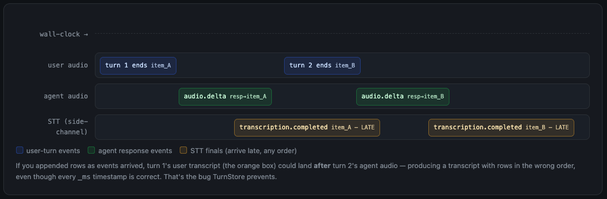

# Real-Time Voice Agent Demo

## Stack

- `realtime-py/`: FastAPI service, fake WAV caller, OpenAI Realtime bridge, transcript persistence
- `realtime-nextjs/`: Next.js app, API proxy routes, demo trigger button, transcript UI
- Storage: JSON files under `realtime-py/data/calls/`
- Model: `gpt-realtime`
- Transcription: `gpt-realtime-whisper`

## How To Run The App

The simplest way to run this is via Docker. For that, you need 2 envs in the `realtime-py` directory.

```bash
cp .env.example .env
# set OPENAI_API_KEY in .env
# optionally set TOOL_CALL_ENABLED to true
docker compose up
```

This will start the Python service and the Next.js app. This will start the NextJS app at `http://localhost:3000`.

Click `Run demo` in the sidebar to trigger the same WAV fixture call from the UI. The button calls Next.js `POST /api/demo-call`, which proxies to Python `POST /demo-call`. When the Python service finishes streaming the three WAV files and saves the transcript, the UI refreshes the call list and selects the new call.

## Architecture

```text
realtime-py/scripts/fake_call.py
  -> streams audio_0.wav, audio_1.wav, and audio_2.wav as timed 20 ms PCM frames
  -> sends user_turn_start / media / user_turn_end events from fixture boundaries

realtime-py/app/server.py
  -> accepts the fake caller WebSocket at /media-stream
  -> forwards audio frames to OpenAI Realtime
  -> commits each WAV turn and requests the response immediately at user_turn_end
  -> streams agent audio frames back to the caller
  -> handles barge-in and writes aligned transcripts
  -> exposes GET /calls, GET /calls/{call_id}, and POST /demo-call

realtime-nextjs/
  -> proxies GET /api/calls, GET /api/calls/[id], and POST /api/demo-call to Python
  -> provides a Run demo button that triggers the fixture call without a terminal script
  -> renders the transcript as chat bubbles with timings and interruption markers
```

#### Order of operations


Python owns the realtime audio loop, OpenAI Realtime WebSocket, barge-in handling, transcript persistence, and latency instrumentation because that is the timing-sensitive part of the system. Next.js owns the demo and review surface: it can trigger the local fixture call, list saved calls, fetch transcript JSON through API proxy routes, and make timestamps and interruptions visible for demo and debugging.

## Real Vs Mocked

Real:

- OpenAI Realtime STT, LLM, and TTS
- Recorded WAV input files
- WebSocket streaming from fake caller to Python and from Python to OpenAI
- Runtime transcript and latency values

Mocked:

- Telephony. There is no Twilio/SIP provider; `scripts/fake_call.py` is the caller.
- Caller timing. The fake caller decides when each WAV starts and when the third recording begins.
- Production endpointing. The demo uses prerecorded WAV fixture boundaries instead of VAD over a live microphone or phone-provider stream.

This implementation chooses OpenAI Realtime because it is faster to integrate and keeps the local service simpler while still exercising the important realtime behaviors: streaming input audio, streaming output audio, interruption, transcript alignment, and latency measurement.

## Audio Format

Input fixtures are WAV files in `realtime-py/fixtures/`. The default fake call uses:

- `audio_0.wav`: "What's on the menu?"
- `audio_1.wav`: "Hey, I want to place an order for a Zinger burger, some fries, and a Coke, please."
- `audio_2.wav`: "Actually, scratch that. I want a chicken piece, fries, and a Coke now."

**Note:** These files were prerecorded but they are still sent as audio frames in real time over the wss connection.

The required fixture format is:

- PCM 16-bit
- 24 kHz
- mono

PCM was chosen because the caller audio clips were recorded on local devices and exported to high-fidelity PCM WAV files. Since this demo does not wire up real SIP or telephony, there is no need to add a mu-law conversion path. Mu-law is mostly useful at a phone-provider boundary; for example, providers like Twilio commonly use it for telephony audio streams.

## Barge-In

The second order-change WAV starts while the agent is speaking. When the fake caller sends `user_turn_start` during an active agent utterance, the service treats that as barge-in and:

- stops forwarding agent audio immediately
- sends `conversation.item.truncate` to OpenAI Realtime with the played audio offset (`send_truncate` in `realtime.py`)
- sends a `clear` event back to the fake caller (`websocket.send_json({"event": "clear", "reason": "barge_in"})` in `server.py`)
- finalizes only the agent text/audio that was actually played
- writes `interrupted: true` and appends `-` to the cut-off text

The transcript intentionally keeps small overlap and delay of 200ms between the interrupted agent turn and the next user turn. That mirrors real detection/playback latency.

## Latency

All four metrics the brief asks for are instrumented. **Numbers below are the average of 10 local runs** against `gpt-realtime`, measured over localhost (no real telephony, mic, or speaker in the loop).

| Metric                     | Avg        | Min | Max  |
| -------------------------- | ---------- | --- | ---- |
| STT first-final            | 910 ms     | 753 | 1061 |
| LLM first-token            | 656 ms     | 485 | 874  |
| TTS first-byte             | 776 ms     | 563 | 1042 |
| **Voice-to-voice (total)** | **834 ms** | 565 | 1209 |

**How each is measured.** All timing uses `time.monotonic()`. The three pipeline stages are measured **server-side**, each as an offset from one zero-point — the moment the user's turn ends (`user_speech_end_clock_ms`):

- **`stt_first_final_ms`** — user-turn-end → the final user transcript event from OpenAI.
- **`llm_first_token_ms`** — user-turn-end → the first streamed agent transcript delta (first "word").
- **`tts_first_byte_ms`** — user-turn-end → the first streamed agent **audio** byte arriving from OpenAI.

**`voice_to_voice_ms`** is measured differently and deliberately: it's taken **at the caller**, not the server. The fake caller stamps the moment it _finishes streaming_ the user audio and the moment it _receives the first agent audio frame back_ over the WebSocket; the difference is the voice-to-voice total. This is the closest honest proxy for what a real caller would feel, because it includes the full round-trip rather than stopping at the server's outbound edge. It's a **call-level** number (measured once, on the first turn), so it lives in the top-level `metrics`; the per-turn `latency_events` array carries only the three server-side stages, which are genuinely measured every turn.

#### Results with tool calling

In the last 5 messages, there is a tool call being done after the first user message, hence the `voice_to_voice_ms` is slightly higher. In production grade, this would be resolved by adding "preambles" in the agent's system prompt. An example like:

```text
# Tools
- Before any tool call, say one short line like “I’m checking that now.” Then call the tool immediately.
```

## Latency Improvements Made and The Async Problem

**Note:** The latency analysis is written below. This section talks about some findings and improvements that were made iteratively.

In the earlier version, I was handling the transcript flow sequentially where after a user WAV finished, it would wait for OpenAI's final transcription event before treating the turn as complete and rendering/saving the result.

1. user WAV finishes
2. wait for OpenAI's final transcription event
3. save the transcription
4. continue with agent response flow

This was an easier implementation and kept things smooth but had impacts on the latency.

After reading some more, I came across recommendations written in some blogs, most notably [Tuning Latency and Accuracy](https://developers.openai.com/api/docs/guides/realtime-transcription#tune-latency-and-accuracy).

Now, when the user WAV finishes, we immediately send `input_audio_buffer.commit` and `response.create`. This means the assistant can start generating the response right away. OpenAI replies with the `input_audio_buffer.committed` event, which carries the `item_id` we use to match events to turns.

However, this created a separate problem too, noted in the OpenAI docs as: "Ordering between completion events from different speech turns isn’t guaranteed. Use `item_id` to match transcription events to committed input items." This was observed where the transcript showed the agent and user messages in the wrong order despite the timestamps in ms being correct (barge in etc).



To handle this, I added a `TurnStore`. The `TurnStore` keeps the final transcript organized. Instead of appending transcript rows directly whenever an OpenAI event arrives, the service first groups related events into a local `Turn`.

#### TurnStore Limitations

Currently, all call state stays in memory until it is saved. This can be fine for short calls but for scalable production use, we would need to persist the call state to a database. Maching is done via `item_id` through a hash map.

## What I'd build next (another day)

**Note:** Right now, `turn_detection` is set to `None`. This has a mocked setup where the `user_turn_end` events are sent manually to mimic the real-time behavior. I did try server VAD earlier but it was turned off because the prerecorded audio files already give clean boundaries which makes it simpler for the mock.

The thing I'd most want to get right and invest time in is deciding when the user has finished talking and optimizing _that_ with latency. When experimenting with server VAD turned on, I noticed that the `silence_duration_ms` decides when a turn is over. This is fair and works for most purposes but as someone with a little bit a stutter in the speech, I realized that this timer cannot safely tell whether the user is thinking or is actually done talking. And upon research, realised that this is a problem faced by many people even non-native speakers.

So turning on flat server VAD, while can be a safe window for this problem, it does mean that this window will be static regardless. Therefore, a better approach can be semantic VAD where it runs a classifier over the words to judge if the utterance is complete. So a sentence that trails off into "ummm…" gets more time automatically and my experience with chatGPT voice mode has been quite similar to this as well where even somewhat long pauses don't prompt the model to start talking and interrupt what I am saying.

This would require further experimentation but if there is a little bit of a compromise on latency enough that the users do not get interrupted too early, this could be a good trade-off.

Therefore, for what I would build next is iterate on this and monitor the results with real audio integrations.

## Bonus: RAG + Function Calling (menu lookup)

For the optional extra, I combined the RAG step and a function-calling tool into one feature: a `lookup_menu` tool the agent calls mid-call, backed by retrieval over a hardcoded KFC menu in `menu_rag.py`.
This is a minimal RAG call over the word "spicy".

**How it works:**

1. The tool `lookup_menu({query})` is declared in the session (`tools` array in `session.update`).
2. When the customer mentions an item, the model emits a `function_call`. The server runs the retrieval, returns the result via `function_call_output`, and asks the model to respond — the full round-trip.
3. The retrieval (the RAG step) lives in `app/menu_rag.py`: each menu line is embedded once at startup (`text-embedding-3-small`), the vectors are held in a plain in-memory list, and `search()` embeds the query and returns the top-k items by cosine similarity. Each item carries `name`, `price`, and `in_stock`.
4. A strict prompt rule makes the agent call `lookup_menu` before confirming any item and only confirm in-stock items, offering an alternative otherwise.

When the user said _"I'm in the mood for something spicy"_, the tool was called with `query='spicy'` and the in-memory search returned the three spicy items:

```
TOOL lookup_menu(query='spicy') -> [Hot Wings, Zinger Burger, Mighty Bucket]   (all in stock)
```

**Note:** The tool calls are saved in the transcript JSON as well and, consequently, rendered in the NextJS UI as well. Under each chat bubble.

## Disconnect Behavior

On a normal `stop` event, Python saves the transcript as complete. If the fake caller WebSocket disconnects mid-call, the server finalizes the partial call, marks any active agent utterance as interrupted, saves the transcript JSON with whatever data exists, and closes the OpenAI-side WebSocket. If the OpenAI-side WebSocket fails first, the service logs the failure and stops the loop; that path is a known limitation compared with the client-disconnect path.

This means a mid-call browser/client failure should not lose all call data. The live stream ends, but the partial transcript remains available for the Next.js UI to load through the Python HTTP endpoints.

## API

Python exposes:

- `GET http://localhost:5050/calls`
- `GET http://localhost:5050/calls/{call_id}`
- `POST http://localhost:5050/demo-call` launches a new instance of mocked audio with barge-in

Next.js proxies:

- `GET http://localhost:3000/api/calls`
- `GET http://localhost:3000/api/calls/{call_id}`
- `POST http://localhost:3000/api/demo-call` launches a new instance of mocked audio with barge-in

## Transcript Shape

Transcript files are saved as timestamp-based IDs, for example:

```text
realtime-py/data/calls/call-20260607T191735726Z.json
```
